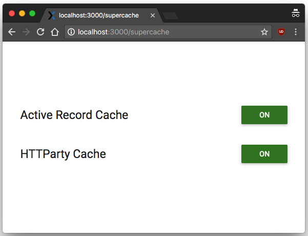

# Supercache

[](https://travis-ci.org/bragboy/supercache)
[](https://codeclimate.com/github/bragboy/supercache)
[](https://hakiri.io/github/bragboy/supercache/master)

Supercache is a totally unobtrusive addon that runs along your Rails application rapidly improving your development time by caching ActiveRecord Queries across requests (unlike ActiveRecord QueryCache which happens only within a single request). This is especially helpful when your local database is located elsewhere and avoids costly DNS lookups for each and every query.

## Installation

Add this line to your application’s Gemfile:

```ruby
gem 'supercache', group: :development
```

And mount the dashboard in your `config/routes.rb`:

```ruby
mount Supercache::Engine, at: "supercache" if Rails.env.development?
```

## Customize Supercache

Once you've included supercache in your devleopment environment, customizing it will be as simple as heading to loclahost:3000/supercache.



You will see two types of caching by default. Activerecord query caching and HTTP Caching. 

## How it works

Please note supercache is to speed up development environment and I strongly recommend against using it in any other environment like a staging or production. It is vital that you understand the pros and cons of caching across requests. 

By default rails caches duplicate queries that are fired within the same request. In instances where you are focused mainly only UI related issues and that you have to refresh your page many times, you will have to painfully wait for the queries to get completed. During these times, Supercache will be a true bliss. All you have to do is turn it ON and your queries are cached across all requests.

Ensure that you turn it off, otherwise you may end up observing your query results are stale. 

## HTTP Caching

Initially I had only ActiveRecord in mind, however while developing I saw a bunch of redundant HTTP requests going from my server to outside world which often are stale themselves. So why not cache it? And thus came the super http cache. This could be typically used if your server is using external requests and that you don't care if they are not fresh.

## Supercache is Super-unobtrusive

While developing supercache, I had wanted to keep it as unobtrusive as possible. Supercache does not bother what type of caching is implemented in your development environment. It could be file cache, Redis, Memcache, In-memory caching, supercache will simply work well with any of them!

## Development

After checking out the repo, run `bin/setup` to install dependencies. Then, run `rake spec` to run the tests. You can also run `bin/console` for an interactive prompt that will allow you to experiment.

To install this gem onto your local machine, run `bundle exec rake install`. To release a new version, update the version number in `version.rb`, and then run `bundle exec rake release`, which will create a git tag for the version, push git commits and tags, and push the `.gem` file to [rubygems.org](https://rubygems.org).

## Contributing

Bug reports and pull requests are welcome on GitHub at https://github.com/bragboy/supercache. This project is intended to be a safe, welcoming space for collaboration, and contributors are expected to adhere to the [Contributor Covenant](http://contributor-covenant.org) code of conduct.

### Running the tests

We're using the
[appraisal](https://github.com/thoughtbot/appraisal) gem to run our test
suite against multiple versions of Rails. Type `rake -T` for a complete list of
available tasks.

The RSpec test suite can be run with `rake`, or
`rake appraisal:rails4.0` to include Rails-specific specs.

## License

The gem is available as open source under the terms of the [MIT License](http://opensource.org/licenses/MIT).

## Scope for Contribution

1. RSpec Integration
2. Add Exceptions to Caching
